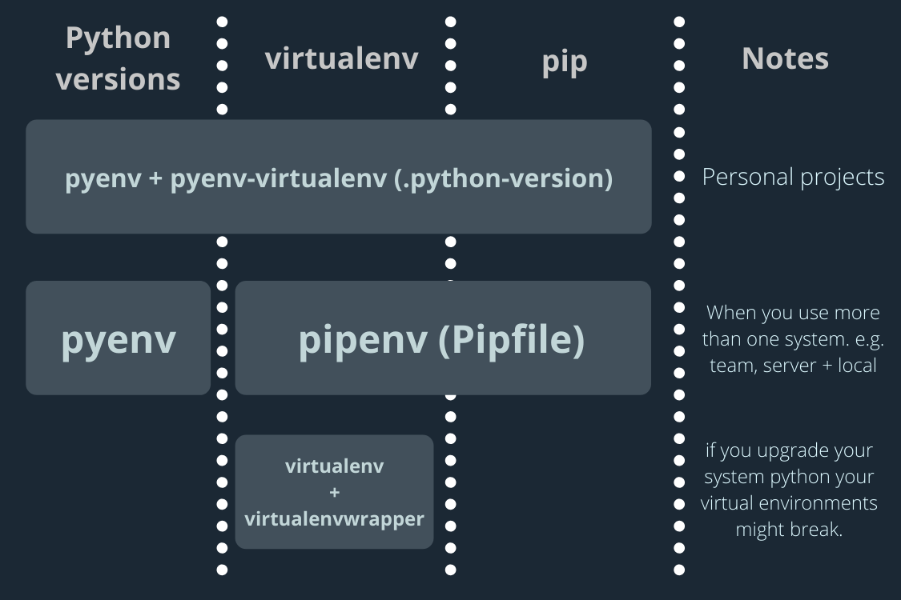

# Use pyenv with pyenv-virtualenv

You shouldn't run `pip install` outside a virtual environment unless you really want to install it globally.

Unlike Bundler for Ruby and npm/Yarn for JavaScript, pip won't create a project-specific directory to store dependencies by default, so you should use [pyenv](https://github.com/pyenv/pyenv) with [pyenv-virtualenv](https://github.com/pyenv/pyenv-virtualenv) to make a project-specific environment.

Every time you create or join a new project, make sure there is a virtual environment for it.

There can be a virtual environment already provisioned with a different tool such as Pipenv or Conda.
In that case, you may not need to create one manually (but you can still safely create your own virtual environment for that project - see the Pipenv on pyenv-virtualenv section below).



ref: https://towardsdatascience.com/python-environment-101-1d68bda3094d

If there is no virtual environment, create a new one with the following commands:

```bash
pyenv virtualenv <python-version> <project-name>
pyenv local <project-name>
```

## Pipenv on pyenv-virtualenv

You can use Pipenv environments on top of the pyenv-virtualenv-provisioned virtual environment.

N.B. By default, Pipenv uses the existing virtual environment if it's running within a virtual environment. To use Pipenv environments within a pyenv-virtualenv-provisioned virtual environment, you need to set `PIPENV_IGNORE_VIRTUALENVS=1`.

Let's say you have the following directory structure:

- main_project/
  - sub_projectA/
    - Pipfile
  - sub_projectB/
    - Pipfile

It's totally fine to create a new virtual environment for `main_project`.
It can even be better to create one since you sometimes need to install pip packages to your project "globally".

In that case, your project-global pip packages are to be installed the virtual environment provisioned with `pyenv-virtualenv` but others for each sub project are to be installed in each Pipenv-provisioned environment.
